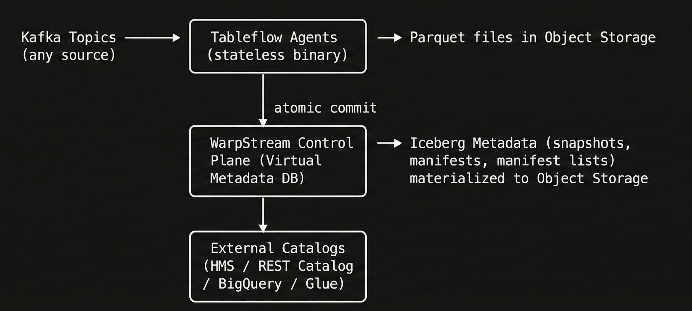

# Elevate 2026 — WarpStream Tableflow Demo

Local tooling and workshop notes for WarpStream Tableflow: Kafka topics materialized as Apache Iceberg tables, queried with DuckDB.

## What is WarpStream Tableflow

[WarpStream Tableflow](https://www.warpstream.com/tableflow) automatically materializes Kafka topics as Apache Iceberg tables in your object storage. It is the simplest path from streaming data to a queryable lakehouse.

- Reads from **any Kafka-compatible source** (OSS Kafka, MSK, Confluent Cloud, WarpStream)
- Supports **JSON, Avro, and Protobuf** formats with inline schema definitions (Schema Registry integration coming soon)
- Deploys as a **single stateless binary** that auto-scales via Kubernetes HPA
- **Zero-ops table maintenance**: compaction, snapshot cleanup, orphan file cleanup, and data expiration run automatically in the background
- **BYOC deployment**: agents run in your VPC; data stays in your object storage bucket
- Integrates with **BigQuery, Databricks, Snowflake, AWS Glue, DuckDB, ClickHouse, Trino, Athena**



Tableflow handles the entire lifecycle — ingestion, schema evolution, partitioning, compaction, and retention — in a single declarative YAML configuration.

## What Tableflow Supports

### Ingestion

- **Formats**: JSON, Avro, and Protobuf with nested types. Schemas are defined inline in the YAML configuration — no external Schema Registry required.
- **Transforms**: Stateless [Bento/Bloblang](https://warpstreamlabs.github.io/bento/docs/guides/bloblang/about) transforms at ingest time — rename fields, drop PII, restructure nested payloads, convert types, or filter records (not demonstrated in this session).
- **Exactly-once semantics**: Parquet file registration and Kafka offset commit happen in one atomic transaction. Failure recovery is not demonstrated today, but the atomic commit guarantees no duplicates and no data loss by design.

### Storage and Query Optimization

- **Partitioning**: Unpartitioned, or by hour/day/month/year, or any arbitrary field with bucket/truncate transforms. Kafka partitioning (for ordering) is independent from Iceberg partitioning (for query pruning) — Tableflow handles the impedance mismatch.
- **Compression**: Configurable per table — snappy (default), zstd, lz4, gzip, brotli, or none.
- **Column statistics**: Parquet files include min/max/null-count stats per column, enabling predicate pushdown in query engines.
- **Schema evolution**: Add fields, widen numeric types, make fields optional — update the YAML config and deploy. Tableflow migrates the Iceberg schema automatically; old rows return `null` for new columns.

### Automatic Table Maintenance

All of the following run in the background with zero tuning:

- **Compaction** — merges small Parquet files into larger ones for better query performance
- **Data expiration** — removes data older than a configurable `retention_ttl` per table, based on record timestamps
- **Snapshot cleanup** — prunes old Iceberg snapshots to reduce metadata overhead
- **Orphan file cleanup** — detects and deletes unreferenced Parquet files

### Catalog Integrations

WarpStream Tableflow exposes a built-in [Iceberg REST Catalog](https://docs.warpstream.com/warpstream/tableflow/iceberg-catalog) and pushes metadata to external catalogs: BigQuery, Databricks Unity Catalog, AWS Glue, HMS (WIP), and Snowflake.

## What This Demo Shows

This demo covers WarpStream Tableflow 101:

1. **Produce protobuf-encoded events** to three Kafka topics representing a subset of an e-commerce data platform
2. **Configure Tableflow** via the Pipeline API to ingest all three topics into Iceberg tables with one YAML file
3. **Query the Iceberg tables** directly with DuckDB — cross-topic joins, aggregations, and time-based filtering
4. **Evolve the schema** by adding a new field through the Pipeline API and observe backward-compatible results

### Demo Scenario

Three topics model distinct layers of an e-commerce data platform:

| Topic | Data | Volume Profile |
| :---- | :---- | :---- |
| `clickstream` | Page views, button clicks, session context | High volume, append-only |
| `orders` | Purchase transactions with line items | Medium volume, business-critical |
| `inventory_updates` | Stock level changes per SKU/warehouse | Low volume, operational |

All topics use **protobuf** with `wire_format: raw` (no schema registry required). Tableflow ingests them into Iceberg tables partitioned by hour.

## Prerequisites

You need:

| Tool | Purpose |
| :---- | :---- |
| macOS or Linux | Local demo host |
| Python 3.9+ | Protobuf producer scripts |
| curl | DuckDB / WarpStream installers |
| Homebrew (macOS) or apt (Linux) | `kcat`, `jq`, optionally WarpStream |
| WarpStream CLI | Local Kafka + Schema Registry + Tableflow playground |
| DuckDB CLI + Iceberg extension | Query materialized Iceberg tables |
| `kcat` | Kafka CLI |
| `jq` | JSON formatting for API responses |

Follow the sections below in order.

## 1. Python setup

Create a project-local virtual environment and install dependencies from `requirements.txt` (`confluent-kafka`, `protobuf`):

```bash
python3 -m venv .venv
source .venv/bin/activate
pip install --upgrade pip
pip install -r requirements.txt
```

Activate in later sessions with:

```bash
source .venv/bin/activate
```

## 2. DuckDB CLI + Iceberg

Install the DuckDB CLI:

```bash
curl https://install.duckdb.org | sh
```

Add DuckDB to your `PATH` (zsh example):

```bash
echo 'export PATH="$HOME/.duckdb/cli/latest:$PATH"' >> ~/.zshrc
source ~/.zshrc
```

Verify:

```bash
duckdb --version
```

Install the Iceberg extension (one-time). Load it again in each DuckDB session:

```bash
duckdb -c "INSTALL iceberg; LOAD iceberg;"
```

For remote Iceberg / S3 access, also install `httpfs`:

```sql
INSTALL httpfs;
LOAD httpfs;
```

## 3. WarpStream CLI

Install the WarpStream Agent / CLI with Homebrew or the installation script:

[Install the WarpStream Agent / CLI](https://docs.warpstream.com/warpstream/getting-started/install-the-warpstream-agent?select=brew,installation-script#brew)

## 4. kcat (Kafka CLI)

```bash
# macOS
brew install kcat

# Linux
apt-get install kafkacat
```

## 5. jq (JSON formatter)

```bash
# macOS
brew install jq

# Linux
apt-get install jq
```

## 6. Environment variables

Copy the example env file and fill in secrets from the WarpStream console (after playground is running — see next section):

```bash
cp .env.example .env
```

`.env` fields:

| Variable | Value |
| :---- | :---- |
| `BASE_URL` | `https://api.warpstream.com` |
| `API_KEY` | Dashboard → API Keys |
| `VIRTUAL_CLUSTER_ID` | Dashboard → Cluster overview (Tableflow / virtual cluster id) |
| `BROKER` | `localhost:9092` (playground Kafka port) |

Load them into your shell:

```bash
set -a && source .env && set +a
```

`.env` is gitignored. Do not commit real keys.

## 7. Start WarpStream Playground

Keep this process running in a dedicated terminal:

```bash
warpstream playground
```

Expected output (cluster IDs and session keys will differ):

```
Creating Schema Registry cluster...
Creating Tableflow cluster...
Creating temporary data directory:
Starting local agents...
Enabling events on the default cluster...

open the developer console at: https://console.warpstream.com/login?warpstream_redirect_to=virtual_clusters%2Fvci_...%2Foverview&warpstream_session_key=sks_...

You now have WarpStream Kafka, Schema Registry, and Tableflow clusters running.

Ports:
    [Kafka Agent]
        Kafka protocol port (TCP): 9092 (override using -kafkaPort)
        internal HTTP port: 8080 (override using -httpPort)
    [Schema Registry Agent]
        Schema Registry protocol (HTTP) port: 9094 (override using -schemaRegistryPort)
        internal HTTP port: 8070 (override using -schemaRegistryHTTPPort)
    [Tableflow Agent]
        internal HTTP port: 8081 (override using -tableflowInternalHTTPPort)
```

Open the console URL from the output, then set `API_KEY` and `VIRTUAL_CLUSTER_ID` in `.env` and reload env vars as in step 6.

## 8. Local Iceberg output directory

```bash
mkdir -p /tmp/warpstream-tableflow-iceberg
```

## Setup checklist

- [ ] `.venv` created and `pip install -r requirements.txt` succeeded
- [ ] `duckdb --version` works and `INSTALL iceberg` succeeded
- [ ] `warpstream` CLI installed
- [ ] `kcat` and `jq` installed
- [ ] `warpstream playground` running (ports 9092 / 9094 / 8081)
- [ ] `.env` filled with `API_KEY` and `VIRTUAL_CLUSTER_ID`
- [ ] `/tmp/warpstream-tableflow-iceberg` exists

## Produce protobuf events

With the playground running and the venv activated:

```bash
source .venv/bin/activate
python scripts/produce-protobuf.py --broker localhost:9092 --count 200 --with-discount
```

Expected success output:

```
  clickstream:            200 events sent
  orders:                 200 events sent (with discount_code)
  inventory_updates:      200 events sent
Done. Total: 600 protobuf messages produced.
```

You may also see a librdkafka telemetry log line (`GETSUBSCRIPTIONS`) — that is harmless.

To keep data flowing continuously (recommended before configuring Tableflow):

```bash
while true; do python scripts/produce-protobuf.py --broker localhost:9092 --count 50 --with-discount; sleep 30; done
```

Verify data is in the topics:

```bash
kcat -b localhost:9092 -t clickstream -C -o beginning -c 3 -f 'Partition: %p | Offset: %o | Bytes: %S\n'
kcat -b localhost:9092 -t orders -C -o beginning -c 3 -f 'Partition: %p | Offset: %o | Bytes: %S\n'
kcat -b localhost:9092 -t inventory_updates -C -o beginning -c 3 -f 'Partition: %p | Offset: %o | Bytes: %S\n'
```

## Configure Tableflow via Pipeline API

Reuse or create a `data_lake` pipeline, deploy the ecommerce YAML config, and start it:

```bash
set -a && source .env && set +a
./scripts/configure-tableflow.sh
```

The script:

1. Lists existing pipelines and reuses a `data_lake` pipeline if present
2. Creates a pipeline configuration for `clickstream`, `orders`, and `inventory_updates` (protobuf / `wire_format: raw` / inline `input_schema` from the `.proto` definitions)
3. Sets desired state to `running`
4. Upserts `PIPELINE_ID` and `CONFIG_ID` in `.env`

Expected `describe_pipeline` overview shape:

```json
{
  "id": "...",
  "name": "data_lake_default",
  "state": "running",
  "type": "data_lake",
  "deployed_configuration_id": "..."
}
```

Parquet files appear within seconds; Iceberg metadata (`v*.metadata.json`) can take ~10 minutes on Playground. Inspect output:

```bash
ls /tmp/warpstream-tableflow-iceberg/warpstream/_tableflow/

CLICKS_TABLE=$(ls -d /tmp/warpstream-tableflow-iceberg/warpstream/_tableflow/ecommerce_kafka__clickstream-*)
ORDERS_TABLE=$(ls -d /tmp/warpstream-tableflow-iceberg/warpstream/_tableflow/ecommerce_kafka__orders-*)
INVENTORY_TABLE=$(ls -d /tmp/warpstream-tableflow-iceberg/warpstream/_tableflow/ecommerce_kafka__inventory_updates-*)

find /tmp/warpstream-tableflow-iceberg -name "*.parquet" | wc -l
duckdb -c "SELECT * FROM read_parquet('$ORDERS_TABLE/data/*.parquet') LIMIT 5;"
```

Example from this session: tables under `/tmp/warpstream-tableflow-iceberg/warpstream/_tableflow/`, Parquet files present, and Iceberg `v*.metadata.json` available within a few minutes.

```bash
find /tmp/warpstream-tableflow-iceberg -name "v*.metadata.json"
```

## Query Iceberg tables with DuckDB

Once metadata exists, set the table path variables (from above) and run:

```bash
export PATH="$HOME/.duckdb/cli/latest:$PATH"
# CLICKS_TABLE / ORDERS_TABLE / INVENTORY_TABLE already set

duckdb -c "
LOAD iceberg;
SELECT 'clickstream' AS tbl, COUNT(*) AS rows FROM iceberg_scan('$CLICKS_TABLE')
UNION ALL SELECT 'orders', COUNT(*) FROM iceberg_scan('$ORDERS_TABLE')
UNION ALL SELECT 'inventory', COUNT(*) FROM iceberg_scan('$INVENTORY_TABLE');
"
```

Expected shape (counts grow as you keep producing):

```
┌─────────────┬───────┐
│     tbl     │ rows  │
├─────────────┼───────┤
│ clickstream │   400 │
│ orders      │   400 │
│ inventory   │   400 │
└─────────────┴───────┘
```

Revenue by payment method:

```bash
duckdb -c "
LOAD iceberg;
SELECT payment_method, COUNT(*) AS order_count,
    ROUND(SUM(total_amount), 2) AS total_revenue,
    ROUND(AVG(total_amount), 2) AS avg_order_value
FROM iceberg_scan('$ORDERS_TABLE')
GROUP BY payment_method
ORDER BY total_revenue DESC;
"
```

Example result:

```
┌────────────────┬─────────────┬───────────────┬─────────────────┐
│ payment_method │ order_count │ total_revenue │ avg_order_value │
├────────────────┼─────────────┼───────────────┼─────────────────┤
│ paypal         │         107 │      27554.87 │          257.52 │
│ card           │         102 │       25428.3 │           249.3 │
│ bank_transfer  │         100 │      24929.09 │          249.29 │
│ apple_pay      │          91 │      21169.09 │          232.63 │
└────────────────┴─────────────┴───────────────┴─────────────────┘
```

More queries (attribution join, inventory snapshot, unified customer view) live in `scripts/queries.sql`. Open that file in the DuckDB UI or paste into an interactive `duckdb` session after `LOAD iceberg;`.

```bash
# Refresh paths if your table UUIDs differ
ls /tmp/warpstream-tableflow-iceberg/warpstream/_tableflow/
```

Note: `produce-protobuf.py` uses the same `user-*` ID space for clickstream `user_id` and orders `customer_id` so the attribution join can match.
